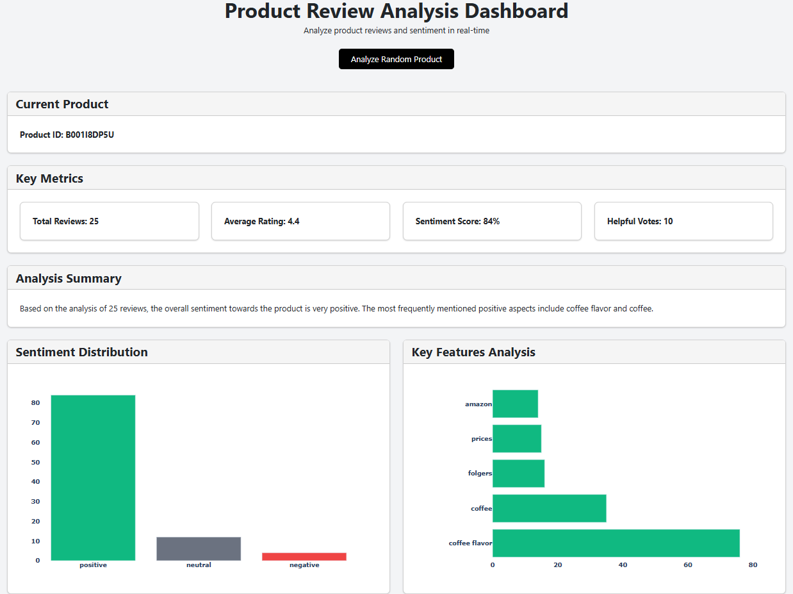

# Product Review Dashboard

Interactive dashboard for analyzing product reviews with sentiment analysis and feature extraction.




## Features
- Real-time product review analysis
- Sentiment distribution visualization
- Key feature analysis
- Interactive metrics display
- Responsive design

## Local Development Setup
1. Clone repository
```bash
git clone https://github.com/ejazalam831/product-review-analyzer
cd product-review-dashboard
```

2. Create virtual environment
```bash
python -m venv venv
source venv/bin/activate  # On Windows: venv\Scripts\activate
```

3. Install dependencies
```bash
pip install -r requirements.txt
python -m spacy download en_core_web_sm
```

4. Place cleaned_reviews.csv.gz in the data/ directory

5. Run the app
```bash
python app.py
```

Access local dashboard at `http://localhost:5000`

## Live Demo
Access the dashboard at: [url]
